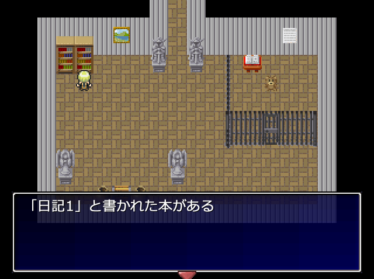

# portfolio
ポートフォリオページ

# Portfolio

- 坂本　彬
- 連絡先 Email[]
- 専門学校デジタルアーツ東京 ゲームプログラムコース 2025年卒業予定

## 資格
-

## スキル
- C#
  - 利用歴1年
  - Visual Studioでの作成が可能
- C/C++
  - 利用歴1年
  - コンソールで簡単なデータ処理プログラムの経験あり
- Unity
  - 利用歴1年
  - オリジナル作品の開発経験あり
- ティラノスクリプト
  - 利用歴2ヶ月
  - オリジナル作品の開発経験あり
- WOLF RPG エディター
  - 利用歴2ヶ月
  - オリジナル作品の開発経験あり

## 取り組んでいるテーマ
- オリジナルゲーム開発
- unity学習

  

## 作品リスト

### 悪魔のサーカス
[]

悪魔のサーカス

モンスターから逃げたり、謎を解いたりしてストーリーを進めていくアドベンチャーゲーム。

- 開発環境：WOLF RPG エディター
- 開発期間：2023/9/8-11/5
- 学園祭参加作品

### 帰り道
[]

残業終わりに出会った謎の少女と一緒に、霊がでると言われている道について調べていくノベルゲーム。

- 開発環境：ティラノスクリプト
- 開発期間：2023/7/23-8/25

### あの世おくり
↓こちらからプレイ

[あの世おくり](http://unityroom.com/games/webgl-up-anoyookuri)

公園でウサギにタックルしていたあなた。すると突然「あの世おくり」されてしまった。
あの世には魔物と化したウサギ?が。あの世から出るには魔物ウサギに近づきタックルして倒すしかありません。
魔物ウサギを倒してあの世から脱出しましょう👊
- 開発環境：unity2023.
- 開発期間：2023/12/18～12/25

## 連絡先
- ブログ
- Twitter 
- E-mail 
